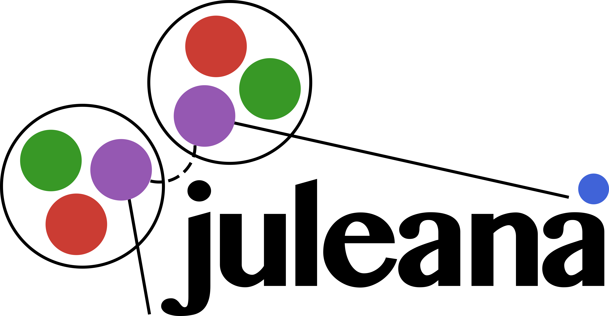

#  
# Dataflow
This package contains the main dataflow scripts to run the analysis for LEGEND-200 data in julia.
It consists of a dataflow implementation to run an analysis on a [SLURM](https://slurm.schedmd.com)-based cluster system including following features:
- Parallel processing of data based on [ParalellProcessingTools](https://github.com/oschulz/ParallelProcessingTools.jl) to interactively connect new SLURM processes to a running `julia` session.
- Data processing of all `tier` up to the `evt` level.
- Automated report generation based on Markdown files with high level overview of each processing step.
- Automated plot generation of monitoring and analysis plots.
- Automated `pars` generation with `validity` flagging
- Partition and run based processing with automated dataflow control.
folder.

# Quick Start
To start the processing just execute the `main.jl` script with the julia interpreter.
``` bash
julia main.jl -c config/processing_config.json
```
You should consider to put all necessary packages in a single environment. The current standard environment is found in the `Project.toml` and `Manifest.toml` files in the dataflow folder and will be automatically activated if no other project is specified. 

# Command line options
The script also offers command line options to have a handy way of processing things in the command line. A help menu is available in the command line with the `--help` flag. The following options are availbale at the moment:

| Command           | Description         |
|-------------------|---------------------|
| `--config`, `-c`  | Path to config file |
| `--periods`, `-p` | Periods to process |
| `--runs`, `-r`    | Runs to process |
| `--partitions` | Partitions to process |
|`--reprocess`      | Reprocess all channels while deleting old data, overwrite all `reprocess` flags |
| `--only_runs`     | Process only runs ignoring periods and partitions |
| `--only_partitions` | Process only partitions ignoring periods and runs |
| `--analysis_runs_only` | Process only runs which are marked as analysis runs |
| `--submit_slurm` | Automatically add a SLURM process to the session |

# Debug mode
To enable the `debug` mode for fast and interactive dataflow debugging and testing, the `-i` flag for `interactive` has to be passed as argument upfront the `main.jl` script.
``` bash
julia -i main.jl -c config/processing_config.json
```
This will start a `debug` menu with the following options:
- **Execute Processors**: Execute individual processors which can be selected from two sub-menus consisting of `processors` and `p-processors`. Additionally, the `reprocess` flag as well as a `check_dependency` flag can be set globally.
- **Reload Processors**: Reload all processor scripts from disk. Good to modify scripts without exiting session.
- **Select Periods**: Select periods which should be processed.
- **Reload processing config**: Reload processing config and `argparse` new from disk. Good to modify `processor` and `p-processor` settings without exiting session.
- **Reset dependency graph**: Reset the dependency graph and restore initial graph before any processing happened and recheck all dependencies.
- **Submit Workers**: Submit new workers to the session. This can be useful to add new workers to the session without exiting the session.
- **Exit**: Exit the debug menu and continue with the processing.

The `debug` menu can be exited with the `Ctrl+c` command.
It can also be manually invoked by calling `menu()` in the julia REPL.

# Setup
To set up the dataflow, you need to have a running `julia` configuration on a login node of a SLURM based cluster with the corresponding acces to the *LEGEND data*. To help you set this up, the folder `setup/` contains helper scripts based on `bash` to guide you through the setup process. 

## Installation
To install your own julia on a cluster and do all necessary pre-steps to be able to process data, you can find a more detailed introduction to Juleana and the setup process in the [How-to-Legend](https://github.com/LisaSchlueter/HowTo-Legend/tree/main) repository including detailed instructions on how to setup things on different clusters. 

**Important**: Before you can run any of the code, you need to make sure that you activated the production environment once and installed all necessary packages. You can do this by running the following command:
``` julia
import Pkg; Pkg.activate("path/to/legend-julia-dataflow")
Pkg.instantiate()
Pkg.precompile()
```

## Production environment
If you want to run the dataflow, you a need a place to store the output of your data production. This is called a prodcution environment. Since it does not only contains your generated data, but also input data like e.g. `legend-metadata`, it requires a certain structure. To help you guide through that process, a bash script is provided `setup/production.sh` to guide you trhough that process. You can run it with the following command:
``` bash
bash setup/production.sh
```
It will ask for the new production name and folder and then create the necessary structure for you. It is sometimes necessary to link certain data folders to different locations to avoid copying the data multiple times. This can be done within the setup process automatically.

## Tmux environment
To run the dataflow, the `main.jl` script will be executed on a login node providing only simple production management functionality while the actual processing happens on the compute nodes. To avoid the script from stopping when you close the terminal, it is recommended to use a `tmux` session. To help you set up a tmux session, a bash script is provided in the `setup/` folder. You can run it with the following command:
``` bash
bash setup/tmux.sh
```
It will create a new tmux session with the name `Juelana` and several windows for the different tasks. You can then attach to the session with `tmux attach -t Juelana` and detach with `Ctrl+b d`. In the `monitoring` window, you will find a current overview of free nodes and jobs in the SLURM queue from your user. This will help you monitor the progress of your jobs and check how many free resources are available and can be accessed by you.

## SLURM integration
After you set up a tmux session, you can start the dataflow by running the `main.jl` script with the julia interpreter in the first window. This will start the dataflow and give you information about the running steps in the terminal. However, this will not start any SLRUM processes for you. So to say, the script will wait at the beginning for new workers which the user has to add manually. This can be done with the `startjlworkers.sh` which the dataflow will write automatically to the dataflow folder. Here, you can find the slurm settings to add workers to the running julia session. You can run the script with the following command:
``` bash
bash startjlworkers.sh
```
Feel free to edit the settings in the script e.g. the number of nodes etc. It is also possible to run the script multiple times to add more workers to the running julia session. This is why the SLURM tab in the tmux session has multiple panes.

**Info** If you activate the `submit_slurm` option, the script will automatically add a new SLURM process to the running julia session. This can be useful to automate the process of adding new workers to the session.

# Configuration File
To comunicate with the dataflow, you need to set up a configuration file. An example can be found in the `config/` folder.
The `processing_config.json` file can be used to set up your own specific analysis chain in a simple JSON format. The file contains the following fields:
## `config`
In the config section, you can pass `ENV` environemnt variables, slurm settings and julia settings. 
1. **`env_variables`**: field can be used to pass environment variables to the analysis. This can be useful to set up the analysis for different data sets. For a stable analysis, you should always set the `JULIA_WORKER_TIMEOUT` variable for `ParallelProcessingTools` and the `GKWSwstype` variable for the `GR` plotting backend. In addition, it can be useful to set the `JULIA_DEBUG` variable to enable debugging information for different packages.
2. **`slurm_settings`**: field can be used to pass options to the slurm processors. All available options can found in the [SLURM documentation](https://slurm.schedmd.com). Please also refer to the documentation of the specific cluster you are using and adapt the settings appropriately.
3. **`julia_settings`**: field can be used to pass options to the julia interpreter. This can be useful to set additional settings for the julia interpreter such as `--heap-size-hint` etc. Please refer to the [`julia` documentation](https://docs.julialang.org/en/v1/manual/command-line-interface/) for all available options.

## `processing`
In the processing section, you can set which `periods` and `runs` you wanna process in your chain as well as different general settings. You can either pass an array with the corresponding run, period and partition numbers in any combination or just use the `"all"` keyword to process all available data such as e.g.
``` json
"processing": {
    "periods": [3],
    "runs": ["all"],
}
```
which will process all available runs in period 3 and only partition 1. You can also use the `"all"` keyword for all fields to process all available data.

Other options are:
1. **`analysis_run_only`**: flag can be used to only process runs which are set as `analysis_run` in the `legend-metadata`. This can be useful to only process runs which have passed quality criteria and are accepted as to be used in the final analysis.
2. **`only_runs`**: flag can be used to only process runs ignoring partitions processors.
3. **`only_partitions`**: flag can be used to only process partitions ignoring runs processors.
4. **`submit_slurm`**: flag can be used to automatically add a new SLURM process to the running julia session. This can be useful to automate the process of adding new workers to the session.

## `processors` and `p_processors`
In the processors section, you can set which processors should be used in the analysis chain.

**Info**: It is necessary to have at least one entry.

You can configure the `processors` section with the following layout
``` json
"process_dsp_cal": {
            "enabled": true,
            "n_workers": "all",
            "category": "cal",
            "rank": 5,
            "kwargs": {
                "reprocess": true,
                "max_wvfs": 1000,
                "timeout": 0,
                "use_partition_filter": true
            },
            "dependencies": ["p_process_aoe_optimization"]
        },
```
which will result in adding the `process_dsp_cal` processor to the list and process it according to its settings. 

**Info**: The `p_processors` work in a similar manner as the `processor` with the one difference that they act on partitions rather then runs.

The following fields are available:
1. **`enabled`**: flag can be used to enable or disable the processor in the chain.
2. **`n_workers`**: field can be used to set the number of workers for the processor. This can be set to `"all"` to use all available workers which will result in a worker pool with the size of the number of channels/filekeys.
3. **`rank`**: field can be used to set the rank of the processor in the chain. This can be useful if the order of the processing matters. The processors will be sorted by the rank and then processed in this order.
4. **`category`**: field can be used to set the category of the processor. This is important to tell the dataflow if the processor is acting on `cal` or `phy` data.
5. **`kwargs`**: field can be used to pass additional keyword arguments to the processor. This can be useful to set specific settings for the processor. Please refer to the processor documentation for all available options.
6. **`dependencies`**: field can be used to set dependencies to other processors. This can be useful if the processor needs to wait for a *partition* processor to finish before it can start. The processor will only start if the *partition* processor (and all lower ranks) has finished successfully.

# Data sync tool

`sync.jl` mirrors part of a remote LEGEND data production onto this machine so
that the dataflow and the analysis scripts can be developed against real data
without an open session on the cluster. The mirror keeps the remote layout, so
`LegendDataManagement` opens it with the config the tool writes beside it.

``` bash
julia --project=. sync.jl --production test
```

This opens a terminal interface:

- The left pane is the production's tree — its `config.json`, then one branch per
  configured path key. Directories are listed when you open them, so nothing
  walks the cluster's filesystem up front.
- The right pane describes the row under the cursor and lists the keys.
- The status bar shows what the current selection would transfer.

| Key | Action |
|-----|--------|
| `↑` `↓` `home` `end` | Move the cursor |
| `enter` | Expand or collapse; lists the directory the first time |
| `space` | Copy this row (`[x]`), or stop copying it |
| `l` | Reach this row through the mount instead (`[~]`); needs `--mount-root` |
| `n` | On a run directory: copy the first N filekeys |
| `e` | Ask rsync exactly what the selection would move |
| `t` | Estimate, confirm, and transfer |
| `s` | Save the selection to `config/sync/<production>.json` |
| `q` | Leave, offering to save first |
| `ctrl+c` | Same as `q`, outside a dialog |

A `[-]` marker means the row itself is not selected but something below it is.
While a transfer is running, the interface accepts no key until it finishes.

## Command line options

| Option | Description |
|--------|-------------|
| `--host ALIAS` | ssh alias of the machine holding the production (default `cslg4`) |
| `--remote-root PATH` | Remote directory holding the productions (default `/mnt/scratch/projects/legend/data/l200`) |
| `--local-root PATH` | Local directory mirroring it (default `../data` next to this checkout) |
| `--mount-root PATH` | Where the remote root is mounted; enables link mode |
| `--production NAME` | Production to sync (default `test`) |
| `--out FILE` | Where the interface saves the selection |
| `--from FILE` | Apply a saved selection without starting the interface |
| `--dry-run` | With `--from`: ask rsync what would move and print it, then stop |
| `--yes` | With `--from`: transfer without asking |

## Re-applying a selection

``` bash
julia --project=. sync.jl --from config/sync/test.json --yes
```

The saved selection lists only the rows that were chosen explicitly, so it stays
readable and keeps working as new runs appear under a chosen directory.

## Requirements

- GNU `rsync` 3.1 or newer on this machine. macOS ships Apple `openrsync`, which
  has neither `--info=progress2` nor a readable `--stats`; install GNU rsync with
  `brew install rsync` and put it ahead of `/usr/bin` in `PATH`. The tool refuses
  to start otherwise rather than transferring without progress or totals.
- `ssh` access to the host, and GNU `find` and `du` on it (both present on
  `cslg4`).

## Link mode

A linked row is not copied: the tool puts a symlink at its place in the mirror
pointing into `--mount-root`, where the remote filesystem is mounted (with
`sshfs`, `rclone mount`, or anything else). Syncing `jlevt` for a run and linking
`tier/raw` for the same run gives a mirror where every file is at its usual path:
the analysis tiers are local, and reading a few waveforms out of a raw file goes
through the mount. With the mount absent, opening a linked file fails with
`ENOENT` rather than appearing to succeed.

## What the tool never does

It never writes to the remote, never deletes local data, and never rewrites the
mirrored `config.json`. The only thing it removes is a symlink it created
earlier that stands where a real copy has to go. The local config it writes is a
sibling, `config_local.json`, so the mirror stays byte-identical to the remote.
